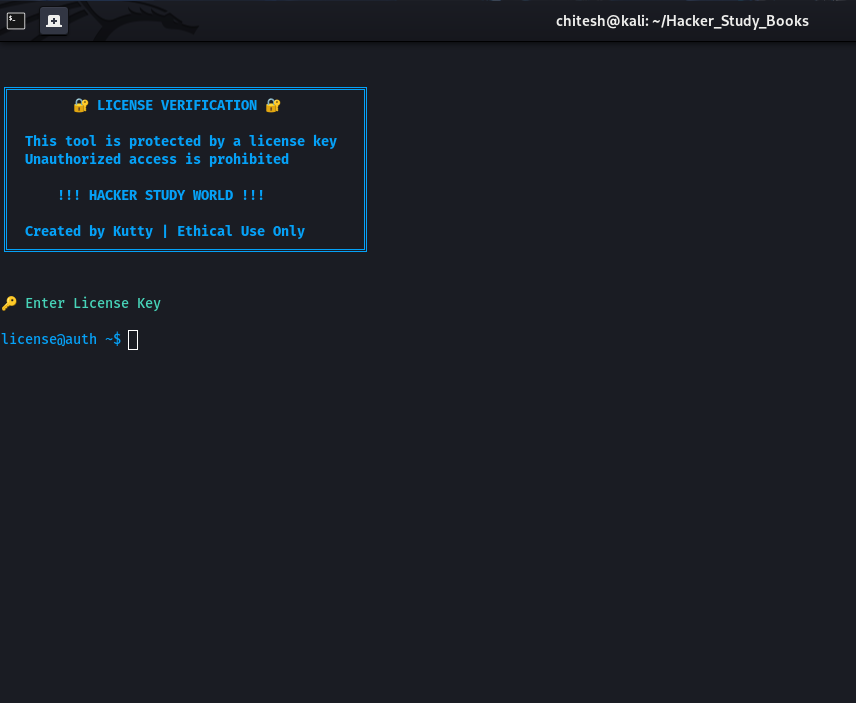
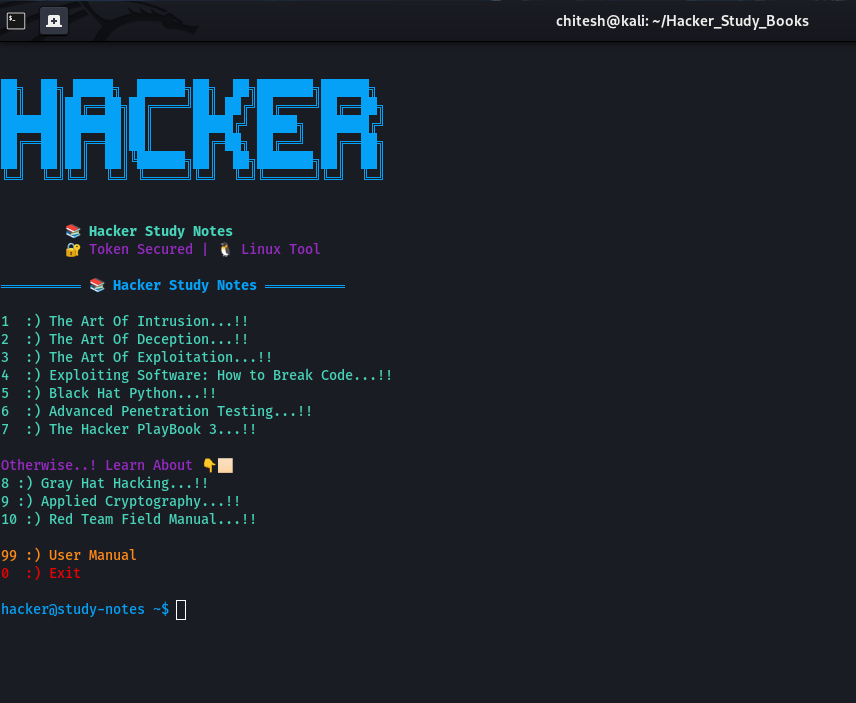

<div align="center">
  
# Hackers Study World
  
</div>

* The goal of this project is to make For Accessing Hacking Books...!

> [!TIP]
> __Hacker Study World__ can also be used as a completely For Studying Purpose So Welcome All The Become Hackers...!  

# Screenshots



## Authentication Required ⚡🎯

### Auth Token Get by Admin Contact via 👇🏻

* Access Via Admin Approval So Contact To Insta & WhatsApp 🧑🏻‍💻⚡

[](https://www.instagram.com/dark_cyber.in/)
[](https://wa.me/17012645961)


* Once Entered The Auth Token Then Access The Books🔥🎯





# Which Books Are Included In This Tools

## 🛡️ Cybersecurity & Ethical Hacking Book Collection


A curated list of **legendary cybersecurity books** covering social engineering, penetration testing, malware analysis, exploitation, cryptography, and red teaming.

> ⚠️ For **educational and defensive security purposes only**

---

## 📚 Table of Contents

- [🧠 Social Engineering](#-social-engineering)
- [💻 Exploitation & Penetration Testing](#-exploitation--penetration-testing)
- [🐍 Security with Python](#-security-with-python)
- [🦠 Malware Analysis](#-malware-analysis)
- [🔐 Cryptography](#-cryptography)
- [🎯 Red Teaming](#-red-teaming)
- [🚀 Suggested Learning Path](#-suggested-learning-path)
- [⚖️ Legal & Ethical Notice](#️-legal--ethical-notice)

---

## 🧠 Social Engineering

| Book | Author | Level | Focus |
|------|--------|-------|-------|
| **The Art of Deception** | Kevin Mitnick | 🟢 Beginner | Human psychology in security |
| **The Art of Intrusion** | Kevin Mitnick | 🟢 Beginner | Real-world hacking case studies |

---

## 💻 Exploitation & Penetration Testing

| Book | Author | Level | Focus |
|------|--------|-------|-------|
| **The Art of Exploitation** | Jon Erickson | 🟡 Intermediate | Programming, memory, and low-level exploitation |
| **Exploiting Software: How to Break Code** | Hoglund & McGraw | 🟡 Intermediate | How attackers discover and abuse vulnerabilities |
| **The Hacker Playbook 3** | Peter Kim | 🟡 Intermediate | Practical penetration testing techniques |
| **Gray Hat Hacking** | Multiple Authors | 🟡 Intermediate | Vulnerability research & ethical hacking |
| **Advanced Penetration Testing** | Wil Allsopp | 🔴 Advanced | Enterprise attack simulation strategies |

---

## 🐍 Security with Python

| Book | Author | Level | Focus |
|------|--------|-------|-------|
| **Black Hat Python** | Justin Seitz | 🟢 Beginner–Intermediate | Building security tools using Python |

---

## 🦠 Malware Analysis

| Book | Author | Level | Focus |
|------|--------|-------|-------|
| **Practical Malware Analysis** | Sikorski & Honig | 🟡 Intermediate | Malware reverse engineering fundamentals |
| **Mastering Malware Analysis** | Alexey Kleymenov | 🔴 Advanced | Advanced malware detection & analysis |

---

## 🔐 Cryptography

| Book | Author | Level | Focus |
|------|--------|-------|-------|
| **Applied Cryptography** | Bruce Schneier | 🟡 Intermediate | Cryptographic algorithms & security systems |

---

## 🎯 Red Teaming

| Book | Author | Level | Focus |
|------|--------|-------|-------|
| **Red Team Field Manual (RTFM)** | Ben Clark | 🔴 Advanced | Command-line & attack reference for pros |

---

## 🚀 Suggested Learning Path

```text
🟢 Beginner → 🟡 Intermediate → 🔴 Advanced

```

# Run Hackers Study Books

__Hackers Study Books__ does not need any installation and runs directly using `python3`

> [!IMPORTANT]
> **Hackers Study Books** requires Python version __1.13 or higher__. Please update Python before running the program.

#### On Linux / macOS :

Make sure all the [required](Contact By Admin & Get Link Or Using GitHub) software are installed.

Open terminal and paste the following commands : 
```
https://github.com/alphamen01-hack/Hackers_Study_Books.git
```

```
cd Hackers_Study_Books/
```

```
python3 Hackers_Study_Books.py
```
#### On Windows :

Make sure all the [required](Contact By Admin & Get Link Or Using GitHub) software are installed.


Open terminal and paste the following commands : 
```
https://github.com/alphamen01-hack/Hackers_Study_Books.git
```
```
cd Hackers_Study_Books/
```
```
python3 Hackers_Study_Books.py
```

> [!NOTE]
> All the new features are primarily tested on **Linux**, thus **Linux** is recommended for running Hackers Study Books.
Some features might not work properly on Windows.


## ⚠️ Disclaimer & Warning

This repository is created **strictly for educational and defensive cybersecurity purposes**.

The books and topics listed here discuss real-world attack techniques, exploitation methods, and security weaknesses. These materials are meant to help readers:

✅ Understand how cyber attacks work  
✅ Build stronger defensive and secure systems  
✅ Practice ethical hacking in legal lab environments  
✅ Prepare for careers in cybersecurity  

---

### 🚫 Illegal Use Prohibited

Using the knowledge from these resources to:

- Access systems without permission  
- Exploit software or networks unlawfully  
- Disrupt services or steal data  

is **illegal** and can lead to **serious criminal charges, fines, and permanent bans from professional fields**.

---

### 🧑‍⚖️ Responsibility

You are fully responsible for how you use the information from these materials.  
Always follow:

✔ Local and international laws  
✔ Responsible disclosure practices  
✔ Ethical hacking guidelines  
✔ Proper authorization before testing any system  

---

### 🛡️ Learn to Defend, Not to Harm

The goal of studying cybersecurity is to **protect systems, users, and data** — not to cause damage.

> 💬 *"With knowledge comes responsibility."*

# 🔗 Developer
---


<p align="left">
  <a href="https://kuttythedarkhacker.netlify.app/" target="_blank">
    
  </a>
  <br>
  <!-- Neon Green Website Button -->
  <a href="https://thedarkdevil.netlify.app/" target="_blank">
    
  </a>
</p>

<br clear="left"/>

---

## ❤️ Support 

Support by following my Instagram page:

<p align="left">
  <a href="https://www.instagram.com/santhosh_kutty_offi?igsh=b2J0b3F4YnBkd2ph" target="_blank">
    
  </a>
</p>

---

© 2026 kutty
